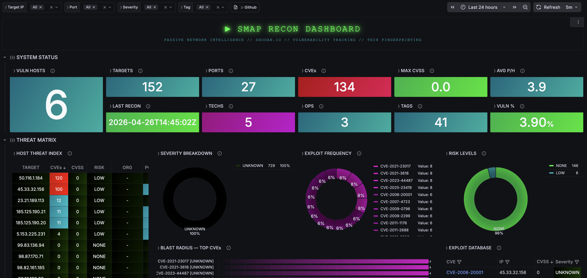
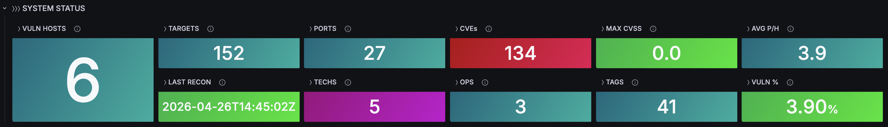
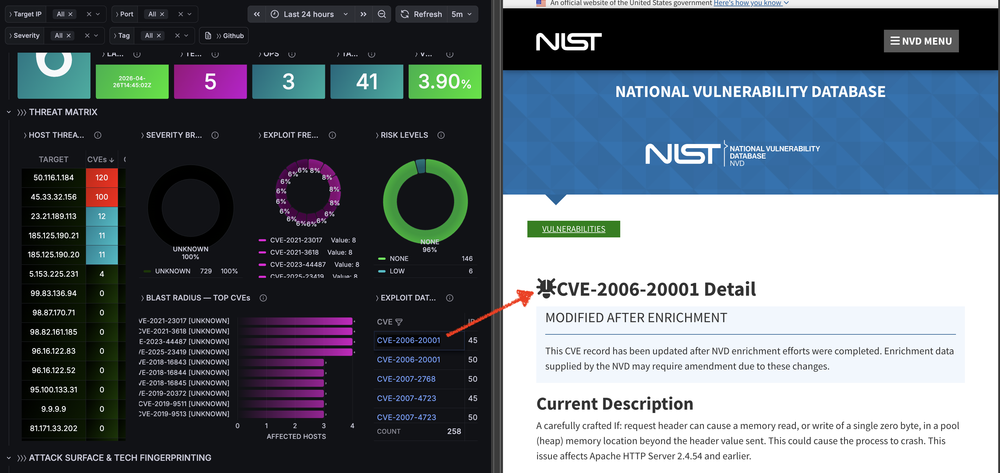
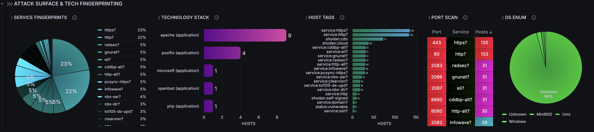
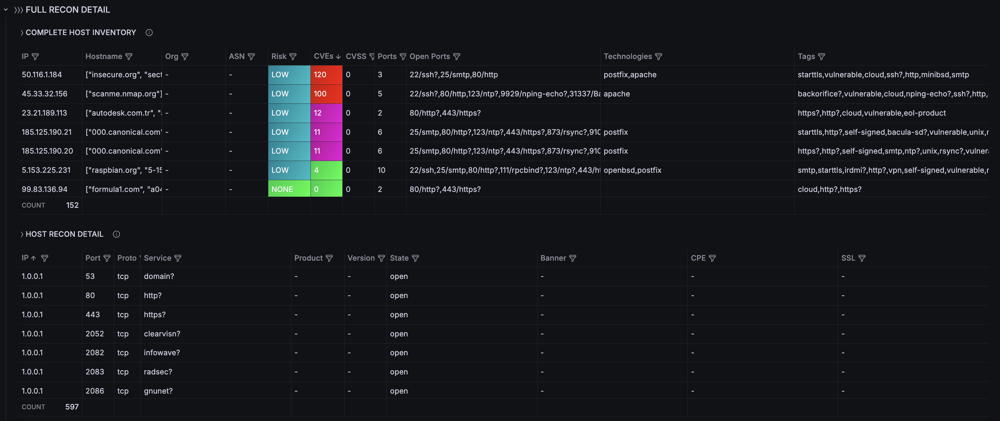
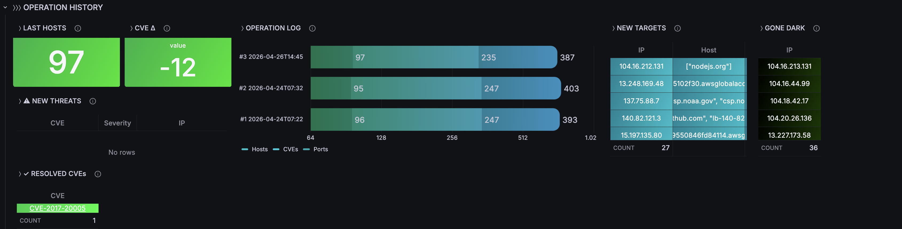

<p align="center">
  <a href="https://github.com/czantoine/smap-grafana-dashboard/blob/main/LICENSE"></a>
  <a href="https://www.linkedin.com/in/antoine-cichowicz-837575b1"></a>
  <a href="https://github.com/czantoine/smap-grafana-dashboard"></a>
  
  <a href="https://github.com/czantoine/smap-grafana-dashboard"></a>
</p>


# Smap Network Scanner – Nmap Alternative with Shodan.io

<a href="https://grafana.com/dashboards/24085">
  
</a>

## Project Overview

This project provides a complete **passive network reconnaissance and threat intelligence pipeline** using [**Smap**](https://github.com/s0md3v/Smap) (a passive Nmap alternative leveraging the Shodan.io InternetDB API), a Python-based multi-format importer, a local SQLite database, and a Grafana dashboard.

The importer (`import_smap.py`) goes far beyond simple JSON-to-SQL conversion — it parses **CVSS scores**, classifies **severity levels**, extracts **technology stacks** from CPE strings, generates **host tags**, computes **per-host risk levels**, extracts **SSL/TLS certificate details**, and supports **geo-enrichment** (country, city, ASN, org). Scan-over-scan diffing enables tracking of new targets, disappeared hosts, new threats, and resolved CVEs.

The Grafana dashboard [(ID: **24085**)](https://grafana.com/grafana/dashboards/24085) renders **30+ panels** across 4 sections with **4 interactive filter variables** (Target IP, Port, Severity, Tag).



> **Ready to run?** Jump to the [Quickstart guide](quickstart/README.md).

---

## Architecture

```
        ┌────────────┐     ┌────────────────────────────-──┐     ┌───────────────────-──────┐
        │            │     │   smap-importer               │     │   grafana                │
        │ targets.txt├────►│                               │     │                          │
        │            │     │  entrypoint.sh                │     │  frser-sqlite-datasource │
        └────────────┘     │  ├─ pre-flight (Shodan test)  │     │         │                │
                           │  ├─ smap -iL targets -oJ      │     │         ▼                │
                           │  └─ import_smap.py            │     │  ┌──────────────────┐    │
                           │     ├─ CVSS scoring           │     │  │  Dashboard       │    │
                           │     ├─ CPE → technologies     │     │  │  ID: 24085       │    │
                           │     ├─ Auto-tagging           │     │  │  30+ panels      │    │
                           │     ├─ SSL/TLS extraction     │     │  │  4 filters       │    │
                           │     ├─ Risk-level computation │     │  └──────────────────┘    │
                           │     └─► smap.db ◄─────────────┼─────┤     (shared volume)      │
                           └───────────────────────────────┘     └─-────────────────────────┘
```

**Data flow:**
1. **Smap** queries the [Shodan InternetDB](https://internetdb.shodan.io/) (free, no API key) for each target and outputs JSON.
2. **`import_smap.py`** parses the output (auto-detecting format), computes CVSS severity and risk levels, parses CPE strings into technologies, generates host tags, and writes everything into `smap.db`.
3. **Grafana** reads `smap.db` through the [frser-sqlite-datasource](https://github.com/fr-ser/grafana-sqlite-datasource) plugin, provisioned automatically.
4. The **dashboard** [(ID: 24085)](https://grafana.com/grafana/dashboards/24085) provides full visibility across 4 interactive filter variables and 30+ panels.

---

## Features

### Import Pipeline (`import_smap.py`)

| Capability | Description |
|---|---|
| **Multi-format parsing** | JSON arrays, JSONL, nmap XML (`-oX`), nmap-json wrappers, Shodan JSON |
| **CVSS severity scoring** | Auto-classifies each CVE: CRITICAL (≥9.0), HIGH (≥7.0), MEDIUM (≥4.0), LOW (≥0.1), NONE |
| **Per-host risk level** | Computes `max_cvss` and `risk_level` for every host |
| **Technology fingerprinting** | Parses CPE strings into `technologies` table (category: application/os/hardware) |
| **Auto-tagging** | Generates tags from Shodan data, OS, detected services, vulnerability status |
| **SSL/TLS extraction** | Certificate subject, issuer, expiry, cipher suite, TLS version |
| **Geo-enrichment** | Country, country code, city, latitude/longitude, organization, ASN, ISP |
| **Product & version** | Extracts software product and version from service fingerprints |
| **Schema migration** | Automatic column additions — safe to run on existing databases |
| **Duplicate prevention** | Deduplicates hosts and CVEs within the same scan |

### Grafana Dashboard [(ID: 24085)](https://grafana.com/grafana/dashboards/24085)

| Capability | Description |
|---|---|
| **30+ panels** | Stats, bar charts, pie charts, donut charts, filterable tables |
| **4 filter variables** | Target IP, Port, Severity, Tag — all panels react in real-time |
| **Severity color coding** | CRITICAL=red, HIGH=pink, MEDIUM=magenta, LOW=cyan, UNKNOWN=dark |
| **NVD deep-links** | Click any CVE to open its NIST NVD detail page |
| **Scan-over-scan diffing** | New targets, gone dark, new threats, resolved CVEs, CVE delta |
| **Technology stack view** | Bar chart of technologies by host count (from CPE parsing) |
| **Host tags visualization** | Bar chart of source:tag distribution |
| **Risk level distribution** | Donut chart of hosts by computed risk level |
| **Auto-provisioned** | Datasource + dashboard loaded automatically — zero manual config |

---

## Database Schema

The importer creates and maintains **7 tables** with **14 indexes**:

```
smap.db
├── scans (1 row/import)        — scan_time, total_hosts, total_ports, total_vulns
├── hosts (1 row/IP)            — ip, hostname, os, geo, org, asn, vuln_count, max_cvss, risk_level
├── ports (N rows/host)         — port, protocol, service, product, version, banner, cpe, ssl_*
├── vulnerabilities (N rows)    — cve, cvss, severity, summary, references_json, verified
├── technologies (N rows)       — category, name, version, cpe (parsed from CPE strings)
├── host_tags (N rows)          — tag, source (shodan / os / service / status)
└── sqlite_sequence             — auto-increment tracking
```

<details>
<summary><b>Full column reference (click to expand)</b></summary>

| Table | Columns |
|---|---|
| **scans** | `id`, `scan_time`, `scanner_version`, `raw_file`, `total_hosts`, `total_ports`, `total_vulns`, `notes` |
| **hosts** | `id`, `scan_id`, `ip`, `hostname`, `status`, `os`, `ttl`, `country`, `country_code`, `city`, `latitude`, `longitude`, `org`, `asn`, `isp`, `vuln_count`, `max_cvss`, `risk_level`, `raw` |
| **ports** | `id`, `host_id`, `port`, `protocol`, `service`, `product`, `version`, `state`, `banner`, `cpe`, `ssl_cert_subject`, `ssl_cert_issuer`, `ssl_cert_expires`, `ssl_version`, `ssl_cipher`, `raw` |
| **vulnerabilities** | `id`, `scan_id`, `host_id`, `port_id`, `cve`, `cvss`, `severity`, `summary`, `references_json`, `verified`, `note`, `raw` |
| **technologies** | `id`, `host_id`, `port_id`, `category`, `name`, `version`, `cpe` |
| **host_tags** | `id`, `host_id`, `tag`, `source` |

</details>

---

## Dashboard Sections

### ⟩⟩⟩ SYSTEM STATUS
> Real-time KPIs for the current scan state.

| Panel | Description |
|---|---|
| LAST RECON | Timestamp of the most recent scan import |
| OPS | Total number of scan operations |
| TARGETS | Unique IPs matching current filters |
| PORTS | Distinct open ports |
| VULN HOSTS | Hosts with at least one CVE |
| CVEs | Unique CVE identifiers |
| TECHS | Distinct technologies from CPE parsing |
| TAGS | Distinct host tags |
| VULN % | Percentage of filtered hosts that are vulnerable |
| MAX CVSS | Highest CVSS score across all hosts |
| AVG P/H | Average open ports per host |



### ⟩⟩⟩ THREAT MATRIX
> Vulnerability analysis and risk prioritization.

| Panel | Description |
|---|---|
| HOST THREAT INDEX | Sortable table: IP, vuln count, max CVSS, risk level, org, ports |
| SEVERITY BREAKDOWN | Donut chart of vulnerabilities by severity (color-coded) |
| EXPLOIT FREQUENCY | Donut chart of the 15 most common CVEs |
| RISK LEVELS | Donut chart of hosts by computed risk level |
| BLAST RADIUS | Bar chart: CVEs ranked by number of affected hosts (with severity label) |
| EXPLOIT DATABASE | Filterable table: CVE ↔ IP ↔ CVSS ↔ Severity ↔ Port ↔ Service |



### ⟩⟩⟩ ATTACK SURFACE & TECH FINGERPRINTING
> Service enumeration, technology stack analysis, and detailed host inventory.

| Panel | Description |
|---|---|
| SERVICE FINGERPRINTS | Pie chart of service/product distribution |
| TECHNOLOGY STACK | Bar chart of technologies by host count (from CPE) |
| HOST TAGS | Bar chart of source:tag distribution (shodan, os, service, status) |
| PORT SCAN | Table: port, service, host count |
| OS ENUMERATION | Pie chart of OS distribution |
| COMPLETE HOST INVENTORY | Full table: IP, hostname, org, ASN, risk, CVEs, CVSS, ports, technologies, tags |
| HOST RECON DETAIL | Table: IP, port, proto, service, product, version, state, banner, CPE, SSL |





### ⟩⟩⟩ OPERATION HISTORY
> Scan-over-scan comparison and trend tracking.

| Panel | Description |
|---|---|
| LAST HOSTS | Number of hosts in latest scan |
| CVE Δ | Vulnerability count delta between last two scans |
| OPERATION LOG | Bar chart comparing hosts/CVEs/ports across recent scans |
| NEW TARGETS | IPs appearing for the first time |
| GONE DARK | IPs that disappeared since previous scan |
| ⚠ NEW THREATS | CVEs first detected in latest scan (with severity) |
| ✓ RESOLVED CVEs | CVEs no longer present |



---

## Why This Approach

| Choice | Rationale |
|---|---|
| **Shodan InternetDB** | Passive, fast, no API key required, ~200 hosts/second |
| **SQLite** | Zero-dependency, single-file database, perfect for lightweight stacks |
| **Python importer** | Full control over parsing, scoring, enrichment — no external services |
| **Grafana + SQLite plugin** | Immediate, shareable visualizations with zero backend infrastructure |
| **Docker Compose** | Reproducible, one-command deployment |

This stack is designed for **monitoring, light SOC workflows, red team recon tracking, and educational purposes**.

---

## Smap

Smap project: [https://github.com/s0md3v/Smap](https://github.com/s0md3v/Smap) — see repository for additional information.

| Feature | Detail |
|---|---|
| **Speed** | ~200 hosts per second |
| **Authentication** | No API key required (uses free Shodan InternetDB endpoint) |
| **Vulnerability detection** | CVE enumeration from service fingerprints |
| **Output formats** | XML (`-oX`), JSON (`-oJ`), greppable (`-oG`), nmap default (`-oN`), all (`-oA`) |
| **Fingerprinting** | Service and version identification via Shodan data |
| **Stealth** | Zero contact with targets — fully passive reconnaissance |

---

You can directly find the [dashboard here](https://grafana.com/grafana/dashboards/24085) or use the ID: **24085**.

---

If you find this project useful, please give it a star ⭐️ ! Your support is greatly appreciated. Also, feel free to contribute to this project. All contributions, whether bug fixes, improvements, or new features, are welcome!

## Stargazers over time

[](https://starchart.cc/czantoine/smap-grafana-dashboard)
